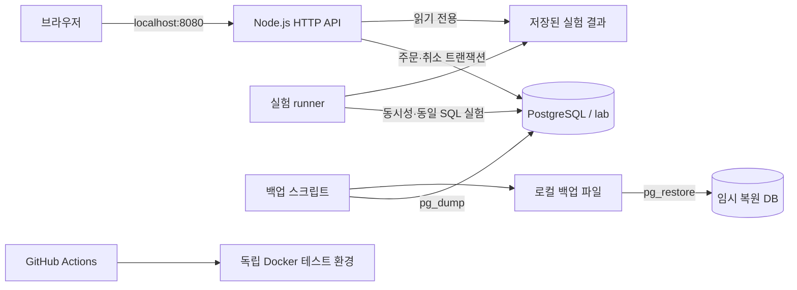

# TestHosting · PostgreSQL 주문·재고 포트폴리오

[](https://github.com/KIMU-02/TestHosting/actions/workflows/validate.yml)

**재고 초과 판매와 느린 주문 조회를 재현하고, 트랜잭션과 인덱스로 개선한 과정을 실제 실행 자료로 설명하는 프로젝트입니다.** PostgreSQL을 중심으로 주문 재시도·취소, 운영 관측, 백업 복원, Docker와 GitHub Actions 검증까지 구현했습니다.

**먼저 볼 자료:** [성능 실측](results/2026-09-11T14-12-27-197Z-c68bbddc/report.md) · [GitHub 검증 성공](https://github.com/KIMU-02/TestHosting/actions/runs/34707666746) · [운영 DB 복원](results/recovery/20260912T100701681Z_0344939e/report.json)

## 해결한 문제와 결과

| 문제 | 구현과 검증 | 확인된 결과 |
|---|---|---|
| 동시 주문의 재고 갱신 유실 | 조건부 UPDATE와 주문 INSERT를 한 트랜잭션으로 처리 | 재고 10개·동시 32요청에서 회차당 초과 판매 **22개 → 0개**, 3회 확인 |
| 고객별 최근 주문 조회 지연 | 필터·정렬에 맞는 복합 인덱스와 INCLUDE | 30만 건·전후 각 480회에서 p95 **49.075ms → 0.838ms** |
| 응답 유실 후 재시도와 중복 취소 | 고객+요청 키 유일 제약, 취소 대상 행 잠금 | 같은 요청 16개 → 주문 1개, 취소 16개 → 재고 복원 1회 |
| 오류와 DB 대기 원인 파악 | 경로별 지연·4xx/5xx·요청 ID, DB 연결·차단 PID | 실제 잠금 생성·해제 및 HTTP 요청 ID 연계 검사 통과 |
| 백업의 복구 가능성 확인 | 임시 DB 복원 후 데이터·제약·쓰기 검사 | 운영 주문 **300,002건**, 요청 키 1건 복원과 정리 완료 |
| 변경 후 기능 회귀 | 독립 Docker 테스트 및 GitHub Actions | 테스트 **22개**, HTTP, 실제 덤프·복원 검사 통과 |

조회 성능은 **2026-09-11 당시 코드·로컬 Docker 환경의 실측**입니다. PostgreSQL 18.4, Node.js 22.23.2, 단일 조회 연결로 측정했습니다. 현재 API 처리량이나 클라우드 성능을 뜻하지 않습니다. 이후 기능 테스트와 이 측정값을 구분합니다.

## 시스템 구조



로컬 Compose는 DB 포트를 외부에 공개하지 않고 API를 `127.0.0.1:8080`에 바인딩합니다. 테스트 Compose는 운영 볼륨·호스트 포트를 공유하지 않습니다. [데이터 모델과 요청 흐름](docs/architecture.md)

## 실행하기

필수 환경은 Docker Desktop의 Linux 컨테이너와 Docker Compose입니다. 저장소를 내려받고 이 README가 있는 폴더에서 실행합니다.

| 목적 | Windows 실행 파일 | 데이터 영향 |
|---|---|---|
| 처음부터 실험하고 화면 실행 | `Run-Docker-Lab.cmd` | 기존 lab 스키마·주문·재고 초기화 |
| 기존 화면/API 업데이트 | `Update-Dashboard.cmd` | 기존 주문·재고 유지 |
| 독립 환경 전체 검증 | `Test-Portfolio.cmd` | 테스트 DB만 생성·초기화·정리 |
| 현재 DB 백업·복원 검사 | `Backup-Restore.cmd` | 원본 유지, 임시 복원 DB 정리 |
| 상태·로그 확인 | `View-Logs.cmd` | 조회만 수행 |

새 환경에서는 `Run-Docker-Lab.cmd` 완료 후 [관리 화면](http://localhost:8080/)에 접속합니다. **보존할 주문이 있으면 전체 실험을 재실행하지 마세요.** 화면 업데이트에는 `Update-Dashboard.cmd`를 사용합니다.

직접 명령으로 새 실험 환경을 구성하려면:

```sh
docker compose build
docker compose up -d --wait db
docker compose run --rm runner npm run seed
docker compose run --rm runner npm run bench
docker compose up -d --wait api
```

종료는 `docker compose down`이며 DB 볼륨은 남습니다. `docker compose down -v`는 DB 볼륨까지 삭제하므로 데이터를 버릴 때만 사용합니다.


## 핵심 설계 판단

### 재고가 음수가 아니어도 초과 판매될 수 있다

취약 구현은 SELECT로 읽은 재고에서 수량을 뺀 값을 다시 덮어씁니다. 같은 재고를 읽은 동시 요청은 CHECK(stock >= 0)를 통과하면서도 초기 재고보다 많은 주문을 승인할 수 있습니다.

```sql
UPDATE lab.products SET stock = stock - $1
WHERE id = $2 AND stock >= $1
RETURNING price_cents;
```

수정된 행이 없으면 거절하고, 주문 INSERT가 실패하면 차감도 롤백합니다. **초기 재고 = 승인 수량 + 잔여 재고**를 검사합니다. 취약 구현은 실험 경로에서만 호출하며 HTTP로 선택할 수 없습니다.

### 같은 조회 조건과 결과로 인덱스를 비교한다

```sql
CREATE INDEX orders_customer_recent_idx
ON lab.orders (customer_id, created_at DESC, id DESC)
INCLUDE (total_cents, status);
```

인덱스 없음/있음/있음/없음(ABBA)을 두 차례 반복하고 동일 SQL·고객 순서·표본 수를 유지합니다. 워밍업 후 원본 시간 960개와 결과 해시, 실행 계획을 남겼습니다. 캐시 영향·인덱스 쓰기 비용·통계적 유의성은 별도 한계로 명시합니다.

### 재시도와 취소도 트랜잭션으로 처리한다

화면은 주문마다 Idempotency-Key를 생성하고 응답이 불명확하면 같은 키를 재사용합니다. **키를 생략한 직접 API 호출에는 중복 방지를 보장하지 않습니다.** 취소는 주문 행의 FOR UPDATE 잠금 안에서 상태 변경과 재고 복원을 함께 커밋합니다. [대안과 HTTP 계약](docs/checkout.md)

## 코드와 증거 탐색

| 관심 영역 | 코드 | 문서 |
|---|---|---|
| 트랜잭션·재시도·취소 | [orders.mjs](src/orders.mjs) | [설계 판단](docs/decisions.md), [주문 계약](docs/checkout.md) |
| 실험과 측정 | [experiments.mjs](src/experiments.mjs), [benchmark.mjs](src/benchmark.mjs) | [측정 방법](docs/methodology.md) |
| 운영 관측 | [monitoring.mjs](src/monitoring.mjs) | [장애 확인 순서](docs/monitoring.md) |
| 복원·자동 검증 | [scripts](scripts), [test](test) | [복원](docs/recovery.md), [CI](docs/ci.md) |

- [성능 원본 JSON](results/2026-09-11T14-12-27-197Z-c68bbddc/results.json), [960개 표본 CSV](results/2026-09-11T14-12-27-197Z-c68bbddc/query-samples.csv)
- [로컬 Docker 전체 검증](results/ci/20260912T095459656Z_cf6d36a1/report.json), [GitHub 원격 검증](https://github.com/KIMU-02/TestHosting/actions/runs/34707666746)
- [대시보드 설계](docs/dashboard.md)

## 구현 범위

완료: 단일 상품 주문, 재고 정합성, 멱등성 키, 주문 취소, 고객별 조회, 성능 실험, 운영 지표, 논리 백업·복원, Docker·GitHub Actions 검증.

미구현: 사용자 인증·실결제, 다중 상품 주문, 운영용 연결 풀·DB 권한 분리, 장기 지표 저장·알림, 원격 백업·PITR, 클라우드 배포·장애 전환. 고객 번호는 인증 수단이 아닙니다. 로컬 계정과 비밀번호는 공개된 실험용 값입니다.

운영 지표는 API 재시작 시 초기화되고 최근 최대 1,000건을 사용합니다. 복원 시간은 서비스 전체 RTO가 아니며 같은 PC의 백업은 PC 전체 장애를 대비하지 못합니다. 이 범위를 넘어선 운영 경험이나 성능을 주장하지 않습니다.
