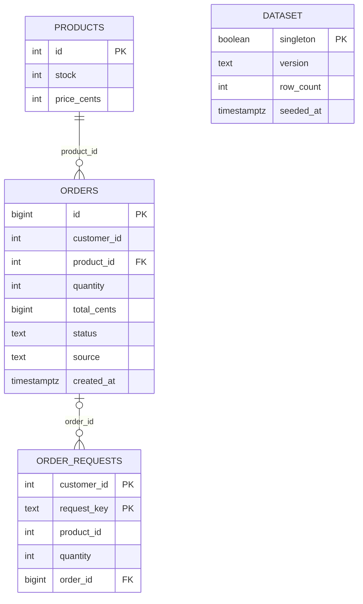
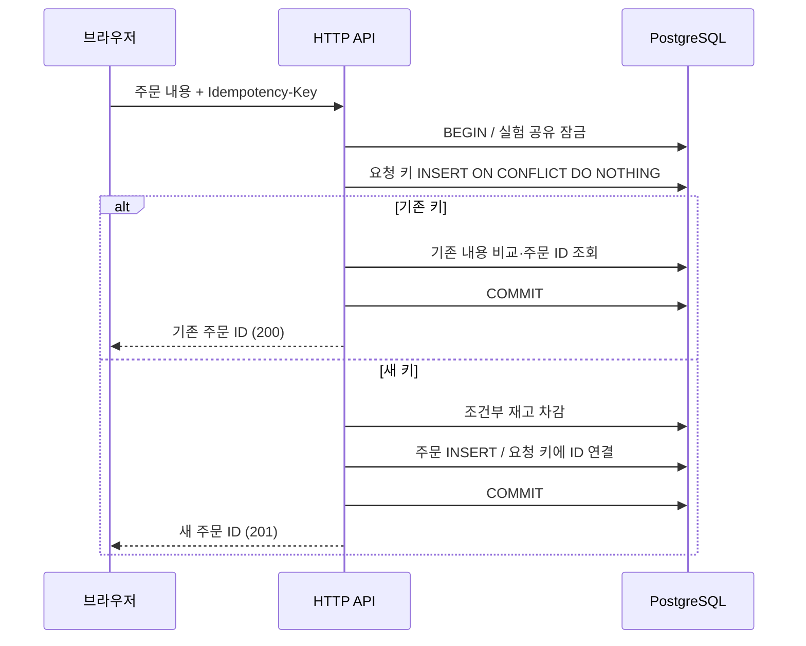

# 데이터 모델과 요청 흐름

ORDER_REQUESTS는 고객·키 복합 기본키입니다. order_id는 NULL을 허용하며 별도 UNIQUE 제약이 없습니다. 요청 키 확보 시 임시로 NULL이고 주문 생성 후 같은 트랜잭션에서 ID를 기록합니다. 임의 SQL까지 주문당 요청 기록 1개를 강제하는 스키마는 아닙니다.

history는 조회 실험용 과거 주문이며 현재 재고와 별도입니다. 운영 현황 집계는 checkout/paid를 사용합니다. paid/cancelled는 로컬 상태이며 실결제와 연동하지 않습니다.

## 주문 처리

내용 충돌·품절·DB 오류가 생기면 트랜잭션 전체를 롤백합니다. 응답만 유실되었으면 같은 키로 커밋된 주문을 확인합니다. 키 없는 API 호출에는 이 보장이 없습니다.

취소는 주문 행 잠금 → 출처·상태 확인 → 재고 증가 → cancelled 갱신을 한 트랜잭션으로 처리합니다. 이미 취소되었으면 재고를 더하지 않습니다.

## 운영과 검증의 경계

- 실험은 배타 advisory lock을 사용합니다. 일반 API는 공유 잠금을 얻지 못하면 503을 반환합니다.
- 운영 모니터링은 현재 요청과 DB 통계를, 성능 보고서는 과거 완료된 Docker 기록을 보여줍니다.
- pg_dump는 원본을 읽고, pg_restore와 쓰기 시험은 별도 생성한 DB에서 수행합니다.
- CI는 독립 Compose 프로젝트를 사용합니다. 원격 CI 성공은 클라우드 운영 배포나 장애 전환 성공을 의미하지 않습니다.

## 문서 변경 이유와 검증

README를 문제·결과·구조·재현·한계 순으로 정리했습니다. 별도 소개 사이트 대신 저장소에서 코드와 원본 증거를 연결하는 방식을 선택했습니다. 검증은 로컬 링크 확인과 실제 성공한 GitHub Actions 실행 확인으로 수행하며 성능을 새로 측정하지 않습니다.
